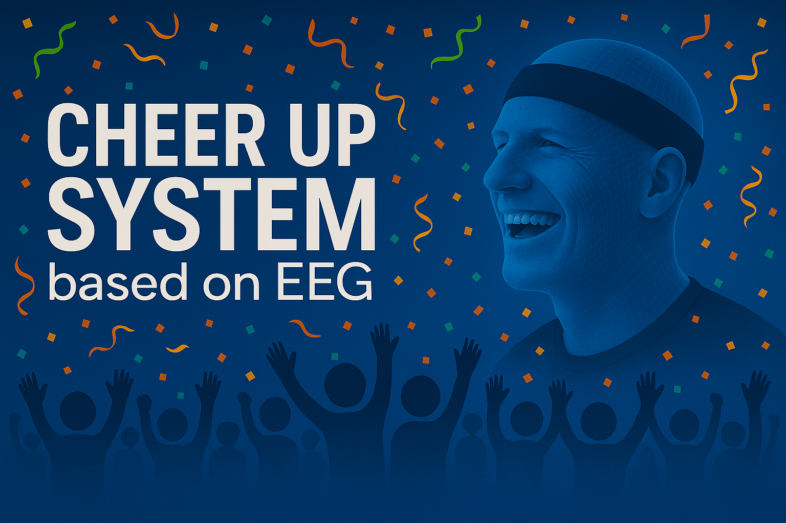

# **FlowSync：Taiwanese style cheer up system based on BCI**

## **Introduction & Vedio Demo**

Cheer Up System based on EEG is a real-time brain-computer interface (BCI) project designed to spark new energy in Taiwan’s sports culture. Our mission is to build a bridge between athletes and fans—emotionally and visually.
 Check out our demo video by clicking the image below!

## **System Pipline**
By decoding EEG signals from athletes using a deep learning model, we estimate athlete's mental state in terms of Valence, Arousal. These emotional signals are sent live to a custom-built cloud server, where they’re transformed into lighting parameters.
Here’s where the magic happens: we created a visual application that turns those parameters into dynamic light displays—fans literally see what the athlete feels. It’s a brand-new way to cheer, connect, and celebrate team spirit through synchronized emotion and immersive atmosphere.

## **Data description**
### Gameemo
This study uses an EEG dataset collected from 28 participants. Each participant played four computer games designed to evoke different emotional states: boring, calm, horror, and funny. Each game lasted 5 minutes, resulting in a total of 20 minutes of EEG recordings for each subject.Subjects rated on participants emotional responses using the Self-Assessment Manikin (SAM) scale, which measures two dimensions: valence (pleasantness) and arousal (intensity).The dataset detail can be found via the following DOI: https://doi.org/10.1016/j.bspc.2020.101951

### Data Preprocessing
this study applied ICA along with the ICLabel tool to automatically classify the ICs extracted from the EEG signals. The following table shows the number of ICs in each category after different preprocessing steps (raw, bandpass filtering, and ASR):

The results show that ASR effectively improves signal quality and enhances the reliability of subsequent emotion recognition analysis.

## **AI Model framework**
Our system brings together signal processing and deep learning to turn raw brainwaves into real-time ambient experiences. Here’s what’s under the hood:
架構圖
## **Evaluation**

### Experiment Setup

To evaluate the performance of our EEG-based Cheer Up System, we tested five different neural architectures across various classification scenarios. The experiments were conducted using EEG data configured under:

- **Channel setups**: 14 channels and 2 channels  
- **Classification tasks**: 4-class and 2-class models  
- **Models tested**:
  - **GitHub EEG-Transformer (original):**
  channel attention --> patch-embedding --> transformer encoder --> classifier
  - **Simplified GitHub EEG-Transformer:**
  simple-patch-embedding --> transformer encoder --> classifier
  - **Standard Transformer:**
  postion-embedding --> transformer encoder --> classifier
  - **1D CNN:**
  1D CNN --> classifier
  - **1D CNN-LSTM:**
  1D CNN --> LSTM --> classifier
  
**data mining:**
first we use the whole data and slice all the data to 2s long (with 1s overlap) with labels to create the training and testing dataset, totally 33264 data. we then split the data into train:test = 7:3, because it can happen that one data in the training dataset overlaps a data in the testing dataset, so to prevent this we slice the data without overlapping each other.

after that, we want to find if we use someone’s data in training and use another data but from the same person as testing data, will it influence the testing result? so we split the data by person with 19 persons’ data in training and another 9 persons in testing (roughly 7:3).

following is the comparison of training & testing result by 3 different methods of generating data

**1s overlap**: slice all preprocessed data into 2s segments with 1s overlapping, creating a total of 33264 data --> split it randomly to train:test = 7:3

**non-overlap**: slice all preprocessed data into 2s segments without overlapping, creating a total of 16688 data --> split it randomly to train:test = 7:3

**split by person**: randomly choose 19 persons to be in the training dataset, and the other 9 persons to be in the testing dataset (roughly 7:3) --> for each dataset, slice the data into 2s segments with 1s overlapping, creating 22572 data in training and 10692 data in testing.

**Result**:
| Testing accuracy(14channel,4classes)     | 1s overlap | non-overlap | split by person  |
|------------------------------|---------------|---------------|------------------|
| **GitHub EEG-Transformer**   | 89.52%        | 84.50%        | 73.85%   |
| **1D CNN**   | 83.43%   | 84.86%    | 78.93%   |

base on this result, it is apparent that the testing accuracy result in "**split by person**" is significantly lower than the others because it prevents any chance to cheat in testing.

in our application scenario, our training data definitely won't come from the audience, so we need to make sure that any data in the testing dataset and training dataset do not come from the same person. we decide to choose "**split by person**" to generate our training and testing dataset.

**training parameter:**
learning rate:1e-3
optimizer:ADAM
Loss function: CrossEntropyLoss
data sample rate: 128/s
**training epochs:**
GitHub EEG-Transformer: 200
Simple EEG-Transformer: 200
1D CNN: 60
Transformer: 120
1D CNN-LSTM: 100
### Results

| Model                         | 14ch, 4-class | 14ch, 2-class | 2ch, 4-class     | 2ch, 2-class     |
|------------------------------|---------------|---------------|------------------|------------------|
| **GitHub EEG-Transformer**   | 73.85%        | 85.34%        | ✘ not converge   | ✘ not converge   |
| **Simple EEG-Transformer**   | **80.61%**    | **88.28%**    | ✘ not converge   | ✘ not converge   |
| **1D CNN**                   | 78.93%        | 86.99%        | **70.97%**       | **84.97%**       |
| **Transformer**              | 77.84%        | 88.27%        | ✘ not converge   | ✘ not converge   |
| **1D CNN-LSTM**              | 75.65%        | 82.50%        | 70.65%           | 80.51%           |

### Key take-aways:
- The **Simple EEG-Transformer** consistently achieved the highest accuracy in both 14-channel tasks, peaking at **88.28%** for 2-class classification.
- **1D CNN** models demonstrated robust performance across all settings and were the only architecture to succeed with reduced channel input (2ch), making them ideal for low-resource applications.
- Models relying heavily on attention mechanisms (like Transformers) failed to converge with fewer channels, suggesting a need for either architectural tuning or richer input features.

---
# **Installation & Setup Guide**

This document provides step-by-step instructions for setting up the dataset, training, and inference environment for this project.

## 1. Dataset Download

Download the dataset from the following link:

[**Dataset Download**](https://www.kaggle.com/datasets/sigfest/database-for-emotion-recognition-system-gameemo)

After downloading, upload the dataset to your Google Drive under the following path: 
    `/content/drive/My Drive/Colab Notebooks/YOUR_PROJECT_NAME/`

## 2. Model Training Notebook

The model training code is located in the `model` directory:

- `train_model.ipynb`

To use it:

1. Download `train_model.ipynb` and upload it to your Google Drive under the path: 
  `/content/drive/My Drive/Colab Notebooks/YOUR_PROJECT_NAME/`
2. Open the notebook in **Google Colab**.
3. Modify all dataset and save path references in the notebook to match your Drive directory structure.
4. Run the notebook to train your model.

## 3. Inference Notebook and Pretrained Weight

The inference notebook and pretrained model are also located in the `model` directory:

- `1DCNN_2ch_4class_push_vad.ipynb`
- `1DCNNmodel_4class_2ch.pt`

To use them:

1. Download both files and place them in your Google Drive under: 
  `/content/drive/My Drive/Colab Notebooks/YOUR_PROJECT_NAME/`
2. Open `1DCNN_2ch_4class_push_vad.ipynb` in **Google Colab**.
3. Update file paths in the notebook to correctly reference the `1DCNNmodel_4class_2ch.pt` model and test data.
4. Run the notebook to perform inference.

---
# References

This project was developed as part of the **Spring 2025 `Brain Computer Interfaces: Fundamentals and Application`** course at National Tsing Hua University.

Special thanks to [**`yang25768`**](https://github.com/yang25768) and [**`jenna0911`**](https://github.com/jenna0911) for their valuable contributions to model development, experimentation, and result interpretation throughout the project.

## External References

- [EEG-Transformer GitHub Repository](https://github.com/YundongWang/BCI_Challenge)
- [Motor Imagery BCI Examples](https://github.com/mikaelhaji/MotorImagery)
- [SSVEP Multi-task Learning Baseline](https://github.com/jinglescode/ssvep-multi-task-learning)

